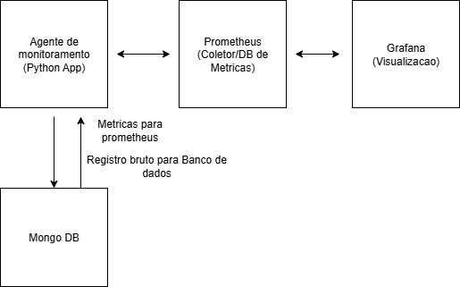
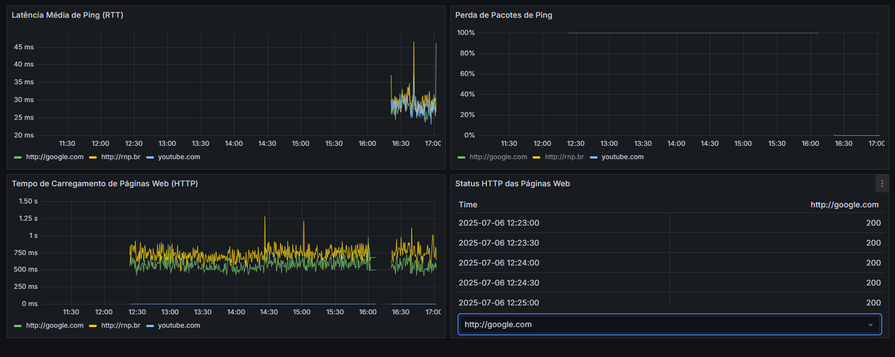
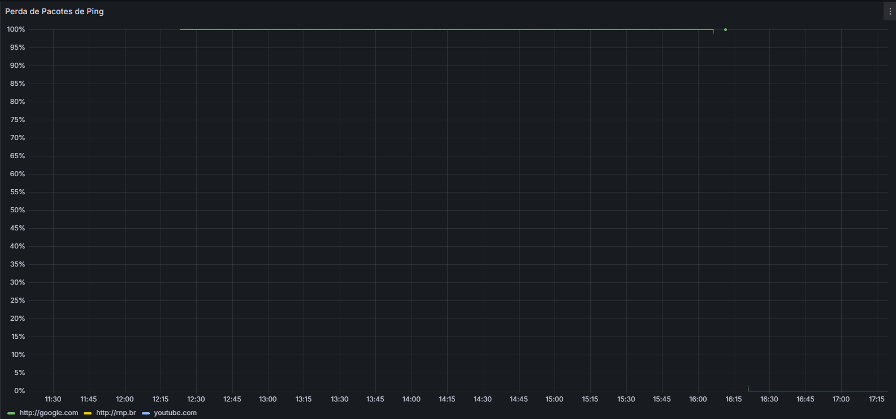
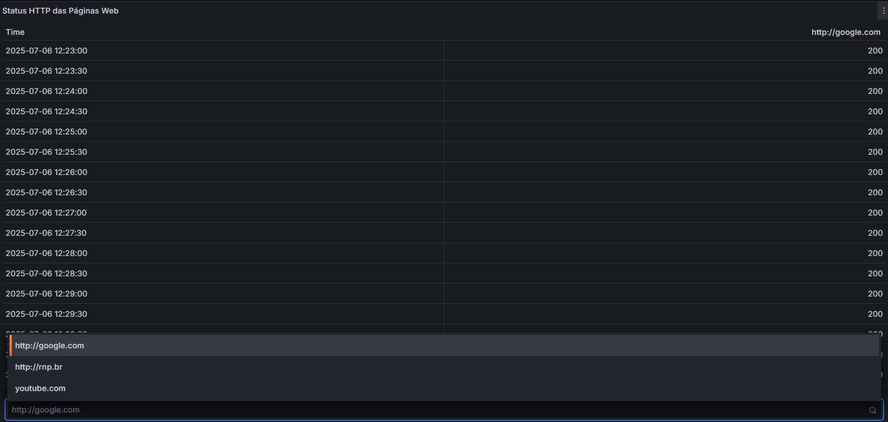

# Desafio DevOps - Monitoramento Web

Este repositório contém a resolução para o desafio prático de Analista de Operações Pleno - foco em DevOps, focado no monitoramento de aplicações web e infraestrutura de rede. A solução implementa um agente de monitoramento em container, armazenamento de dados em banco de dados e visualização através de dashboards no Grafana.

---

## 1. High-Level Design (HLD)

A arquitetura da solução foi projetada para ser modular, escalável e de fácil implantação utilizando `Docker` e `Docker Compose`. Ela é composta pelos seguintes serviços principais:



* **Agente de Monitoramento (`monitor_agent`):** Uma aplicação Python customizada, conteinerizada com Docker, responsável por executar os testes de monitoramento. Ele realiza:
    * **Testes de Ping:** Medição de latência (RTT) e perda de pacotes (%) para alvos de rede específicos (`google.com`, `youtube.com`, `rnp.br`).
    * **Testes HTTP:** Medição do tempo de carregamento de páginas web e captura dos códigos de retorno HTTP (200, 404, etc.) para as mesmas URLs.
    * **Nota sobre `youtube.com`:** Esta URL foi intencionalmente incluída na lista de alvos de monitoramento com a expectativa de que ela retorne um status de erro (geralmente `0` para falha de conexão ou DNS/SSL, ou um código como `404` se for um endpoint HTTP, mas neste caso é uma URL que não é um servidor web padrão). A inclusão de um alvo conhecido por falhar permite demonstrar a capacidade do sistema em **detectar e reportar problemas**, fornecendo insights sobre a robustez do monitoramento e a capacidade de diferenciar entre serviços online e offline/problemáticos.
    * **Exposição de Métricas:** Os resultados são expostos em um endpoint HTTP (`/metrics`) no formato Prometheus.
    * **Persistência de Dados Brutos:** Cada resultado de teste é armazenado como um documento JSON detalhado no MongoDB.

* **MongoDB (`mongodb`):** Um banco de dados No-SQL utilizado para armazenar os resultados brutos e detalhados de cada teste de monitoramento executado pelo agente. Esta camada garante a persistência completa dos dados para análise histórica aprofundada.

* **Prometheus (`prometheus`):** Um sistema de monitoramento e alerta de código aberto. Ele atua como um **Banco de Dados de Séries Temporais (TSDB)**, sendo configurado para raspar (coletar) as métricas expostas pelo Agente de Monitoramento em intervalos regulares. O Prometheus é otimizado para o armazenamento e consulta de dados temporais, sendo a fonte primária de dados para os dashboards no Grafana.

* **Grafana (`grafana`):** Uma plataforma de código aberto para análise e visualização interativa de dados. Ele se conecta ao Prometheus para criar dashboards ricos e dinâmicos, que permitem a visualização em tempo real e histórica das métricas de rede e web coletadas.

---

## 2. Soluções Adotadas e Justificativas

Esta seção detalha as escolhas tecnológicas e a abordagem para cada requisito.

### 2.1. Agente de Monitoramento (Python em Container Docker)

* **Tecnologia:** `Python` com as bibliotecas `requests` (para HTTP), `subprocess` (para ping via CLI) e `prometheus_client` (para exposição de métricas).
* **Justificativa:** Python foi escolhido pela sua simplicidade, rapidez de desenvolvimento e vasto ecossistema de bibliotecas, tornando-o ideal para a criação de um agente leve e eficiente. Além disso, **minha experiência prévia e proficiência com Python** permitiram um desenvolvimento ágil e robusto do agente. A conteinerização com Docker garante isolamento, portabilidade e fácil implantação em qualquer ambiente que suporte Docker. A inclusão de uma URL intencionalmente malformada (`youtube.com`) serve para validar a capacidade do sistema em **capturar e apresentar diferentes cenários de erro ou falha de conexão**, não apenas sucessos.

### 2.2. Testes de Rede (Ping e HTTP)

* **Implementação:** As funções `run_ping_test` e `run_http_test` no `agent.py` executam os testes.
    * **Ping:** Utiliza o comando `ping` nativo do sistema operacional (`iputils-ping` instalado no container) para medir RTT e perda de pacotes, garantindo medições precisas da camada de rede.
    * **HTTP:** Emprega a biblioteca `requests` para simular o carregamento de páginas, capturando o tempo de resposta e o código de status HTTP.
* **Justificativa:** A abordagem híbrida (CLI para ping, biblioteca para HTTP) oferece robustez e precisão para ambos os tipos de teste de rede.

### 2.3. Armazenamento de Resultados (MongoDB e Prometheus)

Este requisito foi abordado com uma estratégia de persistência em dois níveis:

* **MongoDB (Banco de Dados No-SQL):**
    * **Onde:** Os resultados brutos de cada teste são inseridos em uma coleção (`monitor_results`) no MongoDB pelo agente Python.
    * **Justificativa:** Atende diretamente ao requisito de "Banco de Dados (SQL ou No-SQL)". O MongoDB, como um banco de dados No-SQL baseado em documentos, é flexível para armazenar estruturas de dados variadas e é uma excelente escolha para logs e registros detalhados de eventos.
* **Prometheus (Banco de Dados de Séries Temporais - TSDB):**
    * **Onde:** As métricas agregadas (RTT médio, % de perda, tempo de resposta, último status code) são expostas pelo agente e coletadas pelo Prometheus.
    * **Justificativa:** O Prometheus é a ferramenta padrão da indústria para monitoramento de séries temporais. Sua otimização para ingestão e consulta de métricas temporais, combinada com sua integração nativa com o Grafana, o torna ideal para a visualização dinâmica de dados de monitoramento.

### 2.4. Dashboards no Grafana para Visualização

* **Implementação:** O Grafana é configurado para utilizar o Prometheus como sua fonte de dados. Dashboards foram criados com painéis específicos para cada métrica, incluindo gráficos de linha e painéis de status/tabela.
* **Justificativa:** O Grafana oferece uma interface poderosa e flexível para criar visualizações claras e personalizáveis. Permite a rápida identificação de problemas e tendências, transformando dados brutos em inteligência operacional acionável.

---

## 3. Instruções de Execução

Siga os passos abaixo para subir a aplicação e acessar os dashboards de monitoramento.

### Pré-requisitos

Certifique-se de ter as seguintes ferramentas instaladas em seu ambiente:

* **Git:** Para clonar o repositório.
* **Docker:** Para rodar os containers.
* **Docker Compose:** Para orquestrar os múltiplos serviços.

### Passos para Execução

1.  **Clone o Repositório:**
    ```bash
    git clone https://github.com/EduRayzer/desafio_rnp
    cd [pasta_do_seu_repositorio]
    ```

2.  **Suba os Containers:**
    Navegue até o diretório raiz do projeto (onde está o `docker-compose.yml`) e execute:
    ```bash
    docker-compose up --build -d
    ```
    * `--build`: Garante que a imagem do `monitor_agent` seja construída/reconstruída com as dependências corretas.
    * `-d`: Roda os containers em modo detached (em segundo plano).

3.  **Verifique o Status dos Containers:**
    Confirme se todos os serviços estão em execução:
    ```bash
    docker-compose ps ou docker ps -a
    ```
    Você deverá ver todos os serviços (`monitor_agent`, `prometheus`, `grafana`, `mongodb`) com o status `Up`.

4.  **Acesse o Grafana e Configure a Fonte de Dados:**
    Abra seu navegador e vá para: `http://localhost:3000`
    * **Usuário:** `admin`
    * **Senha:** `desafio_rnp123` . É **altamente recomendável** alterá-la no primeiro login.)

    **Configuração da Fonte de Dados Prometheus:**
    Para que o Grafana possa buscar as métricas do Prometheus, você precisa configurar uma fonte de dados:
    1.  No menu lateral esquerdo do Grafana, clique no ícone de **`Administration`** (engrenagem).
    2.  Selecione **`Data Sources`**.
    3.  Clique em **`Add data source`**.
    4.  Escolha **`Prometheus`** na lista de opções.
    5.  No campo **`Name`**, digite `Prometheus Local` .
    6.  No campo **`URL`**, insira a URL do seu serviço Prometheus dentro da rede Docker Compose. Como o Grafana e o Prometheus estão na mesma rede Docker, você pode usar o nome do serviço como hostname: `http://prometheus:9090`
    7.  Deixe as outras opções como padrão, a menos que tenha configurado algo diferente.
    8.  Clique em **`Save & test`**. Você deverá ver uma mensagem de sucesso como "Data source is working".

5.  **Importe o Dashboard Manualmente:**
    Após configurar a fonte de dados, você pode importar o dashboard:
    * No menu lateral esquerdo do Grafana, clique no ícone de **"Dashboards"** (quadradinhos).
    * Clique em **"Import"**.
    * Clique em **"Upload JSON file"** e selecione o arquivo `grafana/dashboards/monitoramento-web-rnp-dashboard.json` do repositório clonado.
    * No campo "Select a Prometheus data source", escolha `Prometheus Local` (o nome que você deu à fonte de dados).
    * Clique em **"Import"**.
    * Se os dados não aparecerem imediatamente, clique no botão **"Refresh dashboard"** (botão de seta circular no canto superior direito do dashboard) e/ou tente ajustar o período de tempo no seletor de tempo do Grafana (ex: "Last 5 minutes", "Last 15 minutes").

### (Opcional) Provisionamento Automático de Dashboards

Para uma experiência mais automatizada, o Grafana pode carregar o dashboard automaticamente na inicialização.

Para ativar esta funcionalidade:

1.  **Descomente as linhas de provisionamento** na seção `volumes` do serviço `grafana` no arquivo `docker-compose.yml`.
    ```yaml
          # - ./grafana/provisioning/dashboards:/etc/grafana/provisioning/dashboards
          # - ./grafana/provisioning/dashboards/dashboards.yaml:/etc/grafana/provisioning/dashboards/dashboards.yaml
    ```
    (Remova os `#` do início de cada linha).
2.  **Reconstrua e reinicie** os containers para que as mudanças tenham efeito:
    ```bash
    docker-compose down -v # O '-v' garante a limpeza para um teste real de provisionamento
    docker-compose up --build -d
    ```
    Após reiniciar, o dashboard deverá aparecer automaticamente no Grafana após o login.


## 6. Detalhes de Construção dos Dashboards (Queries PromQL)

Para aqueles que desejam entender como os gráficos foram construídos ou recriá-los manualmente no Grafana, abaixo estão as principais queries (consultas PromQL) utilizadas para coletar e visualizar as métricas do Prometheus.

Após acessar o Grafana e configurar a fonte de dados Prometheus, você pode criar novos painéis e inserir estas queries no editor de PromQL.

### 6.1. Métricas de Ping

* **Latência Média (RTT) por URL:**
    * **Query:** `avg_over_time(web_ping_rtt_ms_average{job="web_monitor_agent"}[5m])`
    * **Descrição:** Mostra a média do Round Trip Time (RTT) em milissegundos para cada URL monitorada, suavizada ao longo dos últimos 5 minutos. Ideal para gráficos de linha.

* **Perda de Pacotes (%) por URL:**
    * **Query:** `avg_over_time(web_ping_packet_loss_percent{job="web_monitor_agent"}[5m])`
    * **Descrição:** Calcula a média da porcentagem de perda de pacotes para cada URL nos últimos 5 minutos. Também ideal para gráficos de linha.

### 6.2. Métricas HTTP

* **Tempo de Resposta HTTP por URL:**
    * **Query:** `avg_over_time(web_http_response_time_seconds_average{job="web_monitor_agent"}[5m])`
    * **Descrição:** Exibe o tempo médio de resposta em segundos para as requisições HTTP, suavizado ao longo dos últimos 5 minutos. Use para gráficos de linha.

* **Último Status HTTP por URL:**
    * **Query:** `web_http_status_code{job="web_monitor_agent"}`
    * **Descrição:** Retorna o último código de status HTTP reportado para cada URL. Esta query é fundamental para painéis de "Stat" ou "Table" no Grafana, onde você pode aplicar transformações para exibir o status mais recente e colorir com base em limiares (ex: 200 = verde, 4xx/5xx = vermelho, 0 = laranja/vermelho para falha de conexão).

* **Exemplo Específico de Status HTTP para URL com Falha (youtube.com):**
    * **Query:** `web_http_status_code{job="web_monitor_agent", target_url="youtube.com"}`
    * **Descrição:** Filtra o último código de status HTTP especificamente para a URL que esperamos que retorne erros ou falhas de conexão. Ideal para um painel "Stat" individual com limiares para destacar o problema.

---


### (Opcional) Verificando a Persistência no MongoDB

Para confirmar que os dados brutos estão sendo armazenados no MongoDB:

1.  Acesse o shell do container MongoDB:
    ```bash
    docker exec -it mongodb bash
    ```
2.  Entre no shell do MongoDB:
    ```bash
    mongosh
    ```
3.  Mude para o banco de dados e visualize os documentos:
    ```javascript
    use web_monitor_db
    db.monitor_results.find().pretty()
    ```
    Você deverá ver os documentos JSON detalhando cada teste de monitoramento.

---

## 7. Prints dos Dashboards do Grafana

* **Dashboard Geral de Monitoramento Web:**
     * Este dashboard apresenta uma visão consolidada do status de ping (latência e perda de pacotes) e HTTP (tempo de resposta e códigos de status) para todas as URLs monitoradas. Ele permite a rápida identificação de problemas e tendências.
* **Detalhe de Latência e Perda de Pacotes:**
    
    * Foco nos gráficos de linha para latência de ping e porcentagem de perda de pacotes, mostrando a estabilidade da conexão de rede ao longo do tempo.
* **Detalhe de Tempo de Resposta e Status HTTP:**
    
    * Exibe o tempo de carregamento das páginas web e o status de retorno HTTP. A inclusão da URL `youtube.com` demonstra a capacidade do sistema de registrar e exibir cenários de falha, onde um código de status não-200 (ou 0 para falha de conexão) é esperado.

---

## 8. Considerações Finais

Esta aplicação demonstra uma pipeline de monitoramento completa e conteinerizada, cobrindo desde a coleta de dados de rede até a visualização interativa no Grafana. Minha experiência prévia com Python, grafana e prometheus foi fundamental para agilizar o desenvolvimento do agente de monitoramento.

A escolha de tecnologias como Docker, Prometheus e MongoDB visou a robustez e escalabilidade da solução, alinhando-se às melhores práticas de DevOps em ambientes de produção. Estou confiante de que a aplicação cumpre todos os requisitos propostos de forma eficaz.

---
